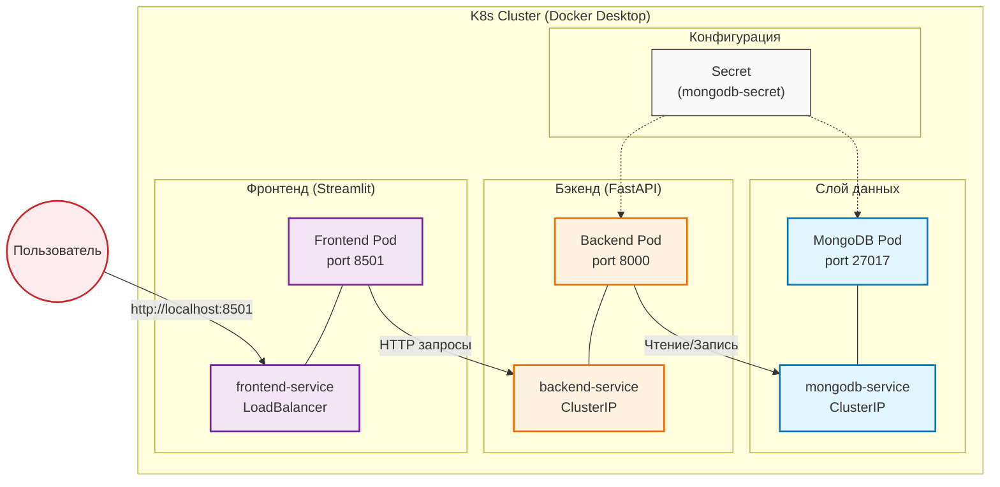

# Отчет по лабораторной работе №4.1. Создание и развертывание полнофункционального приложения

**Выполнила:** Муханова Анна Игоревна  
**Группа:** АДЭУ-221  
**Вариант:** 9 (Event Manager - Менеджер событий)  

## Цель работы
Применить полученные знания по созданию и развертыванию трехзвенного приложения (Frontend + Backend + Database) в кластере Kubernetes. Научиться организовывать взаимодействие между микросервисами и управлять полным жизненным циклом приложения.  

## Архитектура решения

### Описание архитектуры

| Компонент | Назначение | Технологии |
|:----------|:-----------|:-----------|
| **База данных** | Хранение информации о событиях | MongoDB |
| **Бэкенд** | REST API для CRUD операций | FastAPI, Motor |
| **Фронтенд** | Пользовательский интерфейс | Streamlit |
| **Secret** | Безопасное хранение учетных данных | Kubernetes Secret |

